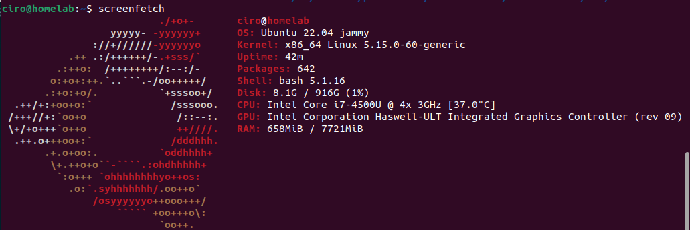
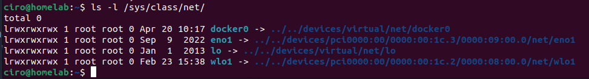

# k3s-gym-app

This application is a test application to understand kubernetes.

Contents
---
  * [Preface](#preface)
  * [Server](#server)
  * [Docker](#docker)
  * [App](#app)
  

<div id='preface'/>

Preface
---
One of the most important things for this project is to create a server.

Then creating and application that will help me get track of my gym status.

Create a k3s cluster to run the application.

Track information of the nodes and cluster.


<div id='server'/>

Server
---

### General Information
For cable:
```bash
ssh ciro@192.168.1.136
```
For wifi:
```bash
ssh ciro@192.168.1.53
```
ciro:usuario

I created a server from and old laptop I had laying around. It is a HP Pavilion 15 Notebook PC. Specs:



It had a broken battery, and sometimes in my house power goes out. So one of the important things to take into accont is how to instantly run the application again just by connecting the power to the server.

At first it had Windows 8 OS, but for the purpose of this app, i deleted it and run Ubuntu Server 22.


### Installing OS system

First, there are a couple of things we need before installing the OS System. We need an empty pendrive (because when burning the image, it's gonna delete everything), and an image burner.  
The next step is choosing which OS to use. In this case I am using Ubuntu Server 22.04 (image), because it's one of the most used versions, and a good place where to start, with a lot of documentation in the internet. Probably, one of the next projects will run in proxmox or red hat linux.  

Because I am gonna burn the image using the application Rufus. When executing Rufus, it will automatically detect the pendrive, select the image previously downloaded (Ubuntu 22.04 in my case) and leave the variables as they are. Burn the image as ISO (in case there's an error try DD). Once it's done, close and release the pendrive.  

Insert the pendrive in our wannabe server, turn it on and press *esc* to access the laptop menu. There it will show you the different options. Click on the key associated to the **BIOS**, in my case F10. Make your way to **System Configuration** to the option **Boot Options**. From there go to **Legacy Support** and enable it. Once done, go to **UEFI Boot Order** and make the option of **USB on Diskette on Key/USB Hard Disk** on top of everything with the key F6. The same has to be done in the options for **Legacy Boot Order**. Save and exit. From there it will show on screen to insert some numbers to confirm changes. Insert the code and click *Enter*.  

The laptop will reboot. Keep click *Esc* to enter the menu of the laptop. Now select the option **Boot Device Option** (F9 in my case). Then select the option of our pendrive without UEFI part, because so far we have done the changes in the Legacy Mode (if this doesn't work, select the with UEFI).

Then Ubuntu Server 22.04 will boot, when it suggests what packages you want installed, I recommend to select: ssh, docker and kubernetes if you have the option.

### Installing dependencies
Because i was stupid, i didnt install docker at the start where it asks you if you want it pre-installed, but i declined.
So in this case, i am gonna give the commands i used to download docker.

```bash
sudo apt-get update
```
```bash
sudo apt install docker.io
```
```bash
sudo snap install docker
```

And now if we run the command
```bash
docker --version
```
we should be able to see the version of the docker we are running.


### Turn on wifi:

To turn on wifi first we have to check if we have a Wi-Fi interface card. For this, we run the commando:
```bash
ls -l /sys/class/net
```

  
Wi-Fi interface cards start with the letter w. In this case, the Wi-Fi interface card name is *wlo1*.

Now we have to change the wifi configuration file, but first we are gonna make a copy of the original just in case things go wrong we can revert to the original state.

```bash
$ sudo cp /etc/netplan/00-installer-config.yaml /etc/netplan/00-install-config.original.yaml
```
Here we can check that it was created correctly. 


To change the file we use:
```bash
sudo vim /etc/netplan/00-installer-config.yaml
```

Now interchange the info with this template.
```yaml
network:
 version: 2 
 wifis:
   wlo1:
     access-points:
       Mywifi1:
         password: yourpassword1
       Mywifi2:
         password: yourpassword2
     dhcp4: true
```
OBS: Be careful with the indentation, in yaml indentation are 2 spaces.

Reboot and you should be able to see the ip of the wifi card.

### Desable default lid actions
Because i dont want the lapton open all the time in my living room, i am gonna disable the lid functions that shutdown, or suspend the system after the lid is closed. To change that we are gonna need to run the following commands on the server:
```bash
sudo systemctl unmask sleep.target suspend.target hibernate.target hybrid-sleep.target
```
```bash
sudo systemctl unmask sleep.target suspend.target hibernate.target hybrid-sleep.target
```
```
# Replace whatever values of following to "ignore"
HandleHibernateKey=ignore
HandleLidSwitch=ignore
HandleLidSwitchExternalPower=ignore
HandleLidSwitchDocked=ignore
```

The only thing left to do is to restart the system
```bash
systemctl restart systemd-logind
```


### Creating virtual machines
To create the virtual machines in the server, we are gonna use `Multipass`. Multipass is a lightweight VM manager for linux, etc. 
Since it supports metadata for cloud-init, you can simulate a small cloud deployment on your laptop or workstation. The installation is pretty easy. 

```bash
sudo snap install multipass
```

Now, to create the virtual machines that will hosts our master-workers. When trying to run the command to create the virtual machines, i ran into this problem


This means that the virtualization is not enabled on the laptop. To solve this problem, in my case, just restart-turn on the computer, and then immedidately press F10 to open BIOS Setup. Use the arrow keys to select the Configuration tab, and the select *Virtualization Technology*. Select Enable, press F10 to save the settings and exit BIOS Setup.

To create the server:
```bash
multipass launch --name k3s-server --cpus 1 --memory 1024M --disk 10G
```
To create the worker node:
```bash
multipass launch --name k3s-agent --cpus 1 --memory 1024M --disk 15G
```
After we created them, we are gonna install `k3s` on the *server* VM. To run commands without entering the VM's, we can make use of the command:
```bash
multipass exec <name-of-VM> -- /bin/bash -c "<command-to-execute>"
```

In this case:
```bash
multipass exec k3s-server -- /bin/bash -c "curl -sfL https://get.k3s.io | K3S_KUBECONFIG_MODE="644" sh -"
```

This will produce a token, which later the worker nodes will use to connect to the master. To get the token we use:
```bash
K3S_TOKEN=$(multipass exec k3s-server -- /bin/bash -c "sudo cat /var/lib/rancher/k3s/server/node-token")
echo $K3S_TOKEN
```
The server will have it's own IP, that for later uses, we are gonna save in a variable to make our life easier.
```bash
K3S_NODEIP_SERVER=$(multipass info k3s-server | grep IPv4 | cut -c17-29)
echo $K3S_NODEIP_SERVER
```
In my case, the ip of the server is: 10.167.49.251  

Now we are gonna add the agent to the cluster.
```bash
multipass exec k3s-agent -- /bin/bash -c "sudo curl -sfL https://get.k3s.io | K3S_TOKEN=${K3S_TOKEN} K3S_URL=https://${K3S_NODEIP_SERVER}:6443 sh -"
```

In my case I didn't have a problem, but if the k3s config file is still not writable, change permissions with 
```bash
sudo chmod 644 /etc/rancher/k3s/k3s.yaml
```

With this we should be done, to test if everything's working correctly, we are gonna enter the server to test if both are running (server and agent). To enter the server terminal, we are gonna run:
```bash
multipass shell k3s-server
```

To check if both are running, run the command:
```bash
kubectl get nodes
```
The output should look like this:


Normally, we wouldn't want our workloads running on the master node and use taints and tolerations to make sure pods are scheduled only on a worker node. In our case, since the setup is not HA (High Available) due to hardware resource constraints, we are going to allow pods scheduling on a master node.


### Set Up Load Balancer
The set up so far consists of bare metal server with 2 VM's on it. To establish traffic between the host PC, and the kubernetes cluster, we need to make sure that all requests sent to the server are forwarded to the Kubernetes master IP, or our k3s-server.  
To make this possible, we will use nginx and replace the default config with load balancing to our cluster. 

```bash
sudo apt install nginx
```

Go to the directory:
```bash
cd /etc/ngnix/
```

And edit the next file to include:
```bash
sudo "${EDITOR:-vi}" nginx.conf
```

```
events {}
stream {
  upstream k3s_servers {
    server ${K3S_NODEIP_SERVER}:6443;
  }
  server {
    listen 6443;
    proxy_pass k3s_servers;
  }
}
EOF
```

If there's another events{} variable with information, comment it with #.Replace ${K3S_NODEIP_SERVER} with the appropiate ip.

### Download Kubeconfig file
To connect from our home PC to the kubernester master, we have to download the kubeconfig file from the server in the home PC and merge it with the kubeconfig file in our home pc.    


The first step is to make sure we have downloaded kubectl in our home PC, if not, it's as simple as following the next commands:  
```bash
curl -LO "https://dl.k8s.io/release/$(curl -L -s https://dl.k8s.io/release/stable.txt)/bin/linux/amd64/kubectl"
```
```bash
curl -LO "https://dl.k8s.io/$(curl -L -s https://dl.k8s.io/release/stable.txt)/bin/linux/amd64/kubectl.sha256"
```

```bash
echo "$(cat kubectl.sha256)  kubectl" | sha256sum --check
```

```bash
sudo install -o root -g root -m 0755 kubectl /usr/local/bin/kubectl
```

After that, we are gonna download the kubeconfig file from the master k3s.
Login to the k3s-server vm:

### Adding admin user to the server
This is a step I forgot to take before as you don't want to try and run some 
commands as a root user. For that we are gonna create a admin user with sudo 
permissions. This command works in Ubuntu Server, in other OS it has probably
 another name.

```bash
adduser <user-name>
```

After creating this user, we want it to have sudo permissions. For that we are
gonna add the user to the sudo group 

```bash
adduser <user-name> sudo  
```

To finish, we will have to log out of the ssh session as the root user, and
start a new one with the new user created.


<div id='docker'/>

## Docker
To containeraze the application in kubernetes, we are gonna use Docker. For that we need to create a Dockerfile. 


<div id='app'/>


## App

### Create virtual environment

As starting point, I'm creating a simple python flask app to test the functionality of the server, 
docker container and the app. It will be just a simple HelloWorld app.

To start with the project, we are gonna create a virtual environment in our local machine that will only have all the neccessary 
packages to run the app. Later, we will save all of this packages in a requirements.txt so that when creating the docker, 
we can just download all the packages with their respective versions.

To create a virtual environment in linux we can just make use of `virtualenv`. If you don't have it installed 
you can install it with the command

```bash 
sudo apt install python3-virtualenv
```

After successful installation we can create our virtual environment with:

```bash
virtualenv <venv_name>
```

In my case I called mine `env`, but normally it would be called `venv`, but it could be called anything.

To activate it, you just have to run the command:

```bash
source <venv_name>/bin/activate
```

### Create simple Flask App

Now we are gonna create our simple HelloWorld app in Flask. You can check out the file `hello.py` that will contain 
all the neccessary code.


```python3
app = Flask(__name__)
```


We will start by creating our Flask application instance with the name app. You pass the special variable `__name__` 
that holds the name of the current Python module. It's used to tell the instance where it is located, you will need
this because Flask sets up some paths behind the scenes.

After creating the app instance, you use it to handle incoming web requests and send responses to the user. `@app.route`
is a [decorator](https://en.wikipedia.org/wiki/Python_syntax_and_semantics#Decorators) that turns a regular python
function into a Flask view function. Which converts the function return value into an HTTP response to be displayed 
by the HTTP client, such as a web browser. In this case, we pass the `'/'` to `@app.route()` to signify that this 
function will responde to web requests for the URL `/`, which mean the base case or main url.

The function `hello()` will return the 'Hello World!!!!' as a response.


To run the web application, we first need to tell Flask where to find our app (the hello.py file in this case) with the
`FLASK_APP` environment variable.

```bash
export FLASK_APP=hello
```

To run it in development mode:

```bash
export FLASK_ENV=development
```

For last we just need to run the application using the command:

```bash
flask run
```

The commands and outputs should look like this:


The app is running locally on the URL `http://127.0.0.1:5000/`. The ip `127.0.0.1` represents
your machines localhost and `5000` is the port number. To run the app in another port number
we can just run the app with:

```bash 
flask run -p <port_number>
```


### Flask templates

Now we are gonna add some templates to the web app. Before, the app was returning a response 
without any HTML. Web Applications mainly use HTML to display information, so now we are gonna
incorporate those elements in our app.  

Flask provides a `render_template()` function that allows the use of *Jinja template engine*. 
This will make managing HTML much easier by writing your HTML code in `.html` files as well as
using logic in your HTML code.

For this, in our web app directory, we first need to create the `templates` directory where all your `.html` files are gonna
reside. The reason for that is that when calling the function `render_template()`, you will need to
pass as an argument the name of the HTML file.

```python
@app.route('/')
def hello():
    return render_template('index_hello.html', title='Hello', message='This is a simple flask webapp')
```

And Flask will look for that file in the `templates` folder in your web app directory.

In addition to the `templates` folder, Flask Web Applications also typically have a static folder 
for hosting static files, such as, JavaScript files, CSS files and images the application uses.

So for this, we are gonna create a `static` folder inside of our app folder, and inside we are gonna create
a `css` folder to host all the `.css` files. This is typically done to organize static files in 
dedicated folders, as such, JavaScript files usually reside in a directory called `js`, images are
put inside the `imgs` folder, and so on.

As someone would think, when creating new html files, you would repeat a lot of unneccessary code
in the HTML files, for that we can make use of a *base template file* which all of the HTML files
will inherit from. We are gonna make use of *Jinja template engine* . You can check the 
[base_hello.html](/templates/base_hello.html) and [index_hello.html](/templates/index_hello.html), to
follow along.


The main specific thing of Jinja engine are:
- ` ` Is a block that serves as a place holder for a title, it's used
so that every template has a custom title without rewriting the entire head section each time.
- `{{ url_for('index')}}` A function that will return the index() view function.
- ` ` Another block that will be replaced by content depending on the 
children template used.

And for the moment that's all we will be touching, now we are gonna containerize the application, 
and run the container to see how docker works.